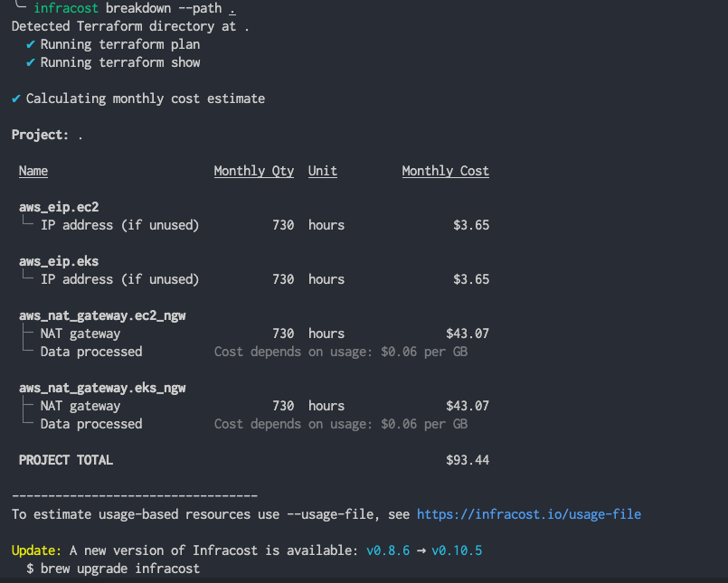
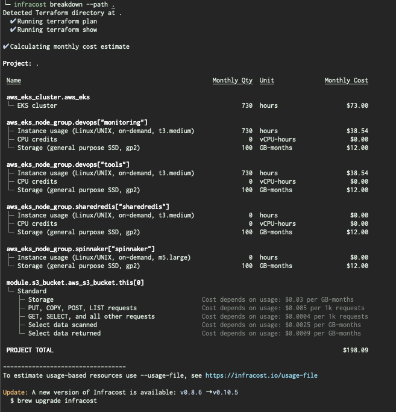

# Infracost

## Install Infracost
- MacOS Brew
  ```
  brew install infracost
  infracost --version # Should show 0.10.5
  ```
- MacOS / Linux Manual
  ```
  # Downloads the CLI based on your OS/arch and puts it in /usr/local/bin
  curl -fsSL https://raw.githubusercontent.com/infracost/infracost/master/scripts/install.sh> | sh
  ```
- Windows Chocolatey
  ```
  choco install infracost
  infracost --version # Should show 0.10.5
  ```
- Windows Manual
  ```
  Download and unzip the latest release. Run it from the Command Prompt or Powershell using .\infracost.exe alongside other required commands/flags. You should also move the exe file to a folder that is in your PATH environment variable, e.g. C:\Windows.
  ```
- Docker
  ```
  docker pull infracost/infracost:ci-latest

  docker run --rm \
  -e INFRACOST_API_KEY=see_following_step_on_how_to_get_this \
  -v $PWD/:/code/ infracost/infracost:ci-latest breakdown --path /code/
  ```

## Get API
```
infracost register
```

## Showcase Estimate
```
cd terraform/environment/providers/aws/infra/resources/eks
infracost breakdown --path .
```

## Example Result

- Breakdown Core Infrastructure

  

- Breakdown EKS

  
